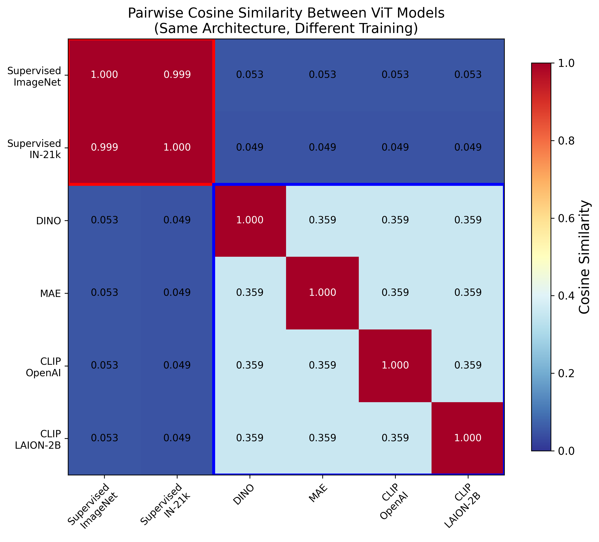
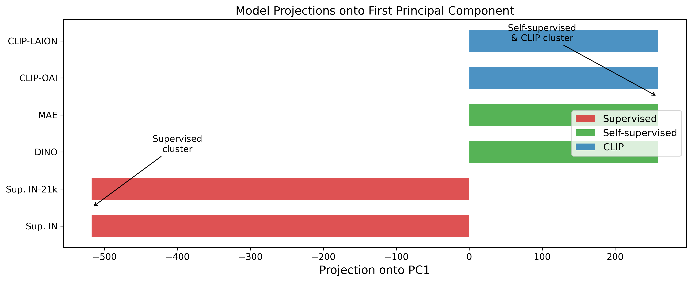
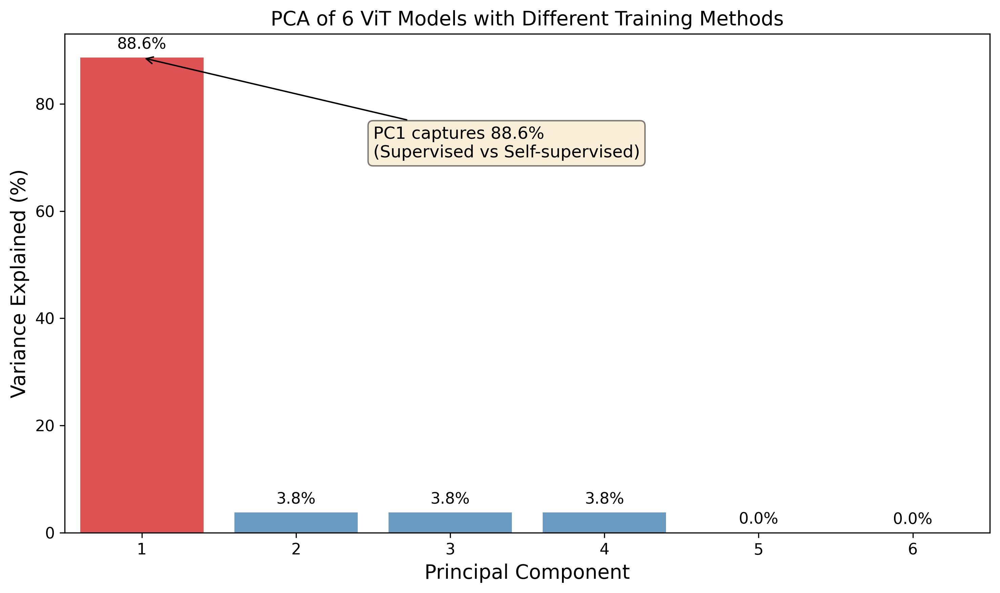

# Critical Analysis of the Universal Weight Subspace Hypothesis

This repository contains a critical examination of the "Universal Weight Subspace Hypothesis" proposed in [arXiv:2512.05117](https://arxiv.org/abs/2512.05117), which claims that neural networks systematically converge to shared spectral subspaces regardless of initialization, task, or domain.

## Key Findings

We find that the paper's claims **do not hold** when testing across genuinely diverse training objectives:

### 1. Models Cluster by Training Method, Not Universally

When analyzing Vision Transformers (ViT-Base, 85M parameters) with identical architectures but different training methods:

| Comparison | Cosine Similarity |
|------------|-------------------|
| Supervised vs Supervised | 0.999 (nearly identical) |
| DINO vs MAE vs CLIP | ~0.36 (moderate) |
| **Supervised vs Self-supervised** | **~0.05 (nearly orthogonal)** |

### 2. PC1 Separates Training Objectives

The first principal component (capturing 88.6% of variance) doesn't represent a "universal" direction—it separates models by training objective:

- **Supervised models**: Negative on PC1
- **Self-supervised models (DINO, MAE, CLIP)**: Positive on PC1

### 3. Methodological Concerns with Original Paper

- **LoRA results**: Trivially expected (LoRA is low-rank by design)
- **LLaMA results**: All share the same base model
- **ViT results**: Likely dominated by supervised ImageNet models, missing diversity in training objectives

## Conclusions

1. The "universal subspace" finding appears to be an artifact of sampling models with similar training methodologies
2. Different loss functions create different loss landscapes, leading to different solutions (expected behavior)
3. Models with identical architecture but different training objectives occupy **nearly orthogonal** subspaces
4. The paper may conflate "models trained similarly cluster together" with "all models converge to a universal subspace"

## Repository Structure

```
├── README.md                      # This file
├── report/
│   ├── universal_subspace_report.pdf   # Full analysis report with figures
│   ├── universal_subspace_report.tex   # LaTeX source
│   └── figures/                   # Generated figures
├── replicate_vit_analysis.py      # Main replication script (20 ViT models)
├── analyze_vit_pc1.py             # PC1 analysis with diverse training methods
├── check_vit_architectures.py     # Verify identical model architectures
├── experiments/
│   └── current/vit_subspace_replication/
│       ├── results.json           # 20 ViT model PCA results
│       └── pc1_analysis.json      # 6-model diverse training analysis
└── src/                           # Utility modules
```

## Quick Start

### Replicate the 20-ViT Analysis

```bash
pip install torch transformers numpy huggingface_hub
python replicate_vit_analysis.py
```

### Analyze Models with Diverse Training Methods

```bash
python analyze_vit_pc1.py
```

### View the Full Report

```bash
open report/universal_subspace_report.pdf
```

## Models Analyzed

**20 HuggingFace ViTs** (mostly supervised/fine-tuned variants):
- Various `google/vit-base-patch16-224` derivatives
- Various `timm/vit_base_*` models

**6 Models with Diverse Training** (key analysis):
| Model | Training Method | Data |
|-------|----------------|------|
| google/vit-base-patch16-224 | Supervised | ImageNet |
| google/vit-base-patch16-224-in21k | Supervised | ImageNet-21k |
| timm/vit_base_patch16_224.dino | DINO (self-supervised) | ImageNet |
| timm/vit_base_patch16_224.mae | MAE (masked autoencoder) | ImageNet |
| timm/vit_base_patch16_clip_224.openai | CLIP | 400M image-text pairs |
| timm/vit_base_patch16_clip_224.laion2b | CLIP | LAION-2B |

All models have **identical architecture** (verified):
- Hidden size: 768
- Layers: 12
- Attention heads: 12
- Parameters: 85,798,656

## Key Figures

### Cosine Similarity Heatmap


*Supervised and self-supervised models are nearly orthogonal despite identical architectures.*

### PC1 Projections


*PC1 separates models by training objective, not universal convergence.*

### Variance Explained


*88.6% of variance in PC1 represents the supervised vs self-supervised distinction.*

## Related Work

- **Platonic Representation Hypothesis** ([arXiv:2405.07987](https://arxiv.org/abs/2405.07987)): Claims representations (not weights) converge. Our findings don't contradict this—models can have similar representations with different weights.

## Citation

If you use this analysis, please cite:

```bibtex
@misc{universal_subspace_critique,
  title={Critical Analysis of the Universal Weight Subspace Hypothesis},
  year={2025},
  url={https://github.com/DoubleAffine/hecke-algebra}
}
```

## License

MIT
